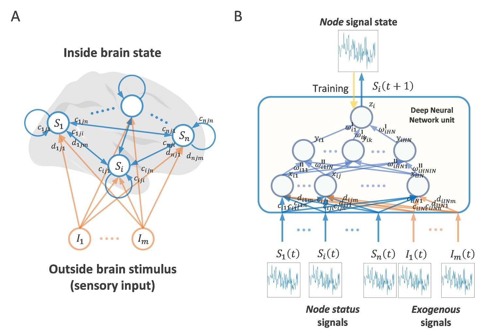
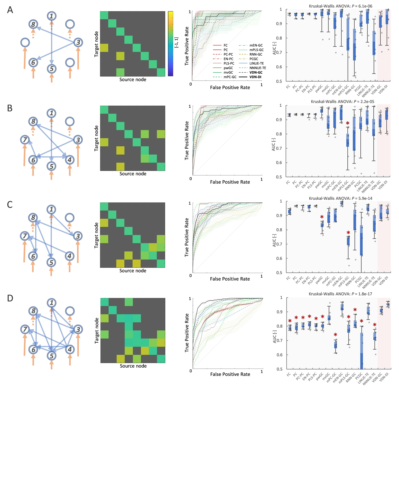
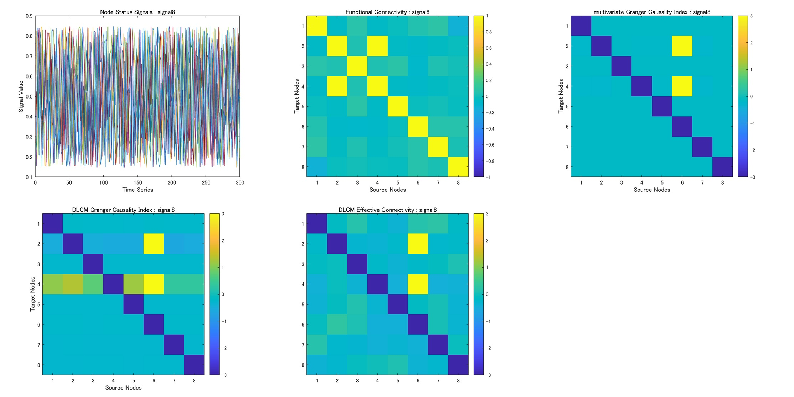
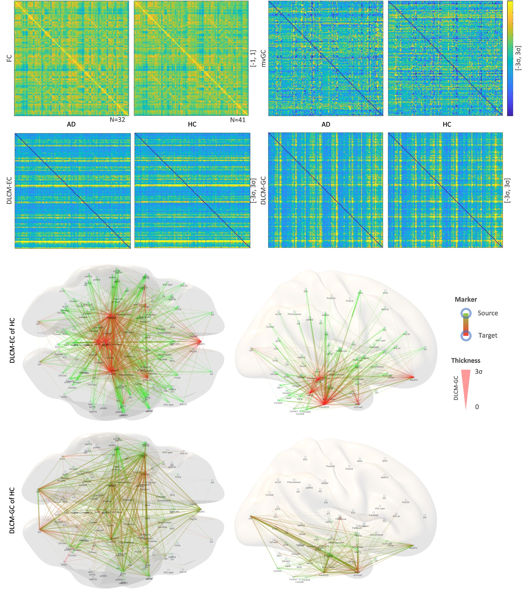

# Vector Auto-Regressive Deep Neural Network (VARDNN) Toolbox

## Introduction
VARDNN is a powerful tool of data-driven analysis technique to estimate directed FC (Functional Connectivity).
Based on VARDNN framework, two types of directed FC are defined, such as VARDNN-DI and VARDNN-GC to measure causal relation among multiple time-series data.

This toolbox includes several functional connectome measures, such as VARDNN-DI, VARDNN-GC, VARLSTM-GC, multivariate Granger Causality (GC), pairwise GC,
multivariate Principal Component (PC)-GC, multivariate Partial Least Squares (PLS)-GC, multivariate Elastic Net (EN)-GC, linear Transfer Entropy, 
Functional Connectivity (Correlation), Partial Correlation, PC-PC, PLS-PC, EN-PC and Wavelet Coherence to estimate conectivity from multiple node signals.

Command line tool could perform conectivity estimation with several functional connectome measures from node signals in csv or mat file,
then show output of causal relational matrix and save data in csv or mat file.

## Requirements: software
* MATLAB R2019a or later
* Deep Learning Toolbox ver12.1 or later
* Fuzzy Logic Toolbox ver2.6 or later

## Command line tool
~~~
>> vardnn -h
usage: vardnn [options] filename.csv ...
  -d, --vddi          output VARDNN Directional Influence matrix result (<filename>_vddi.csv)
  -c, --vdgc          output VARDNN Granger Causality matrix result (<filename>_vdgc.csv)
  -m, --mvgc          output multivaliate Granger Causality matrix result (<filename>_mvgc.csv)
  -g, --pwgc          output pairwise Granger Causality matrix result (<filename>_pwgc.csv)
  -t, --te            output (LINUE) Transfer Entropy matrix result (<filename>_te.csv)
  -f, --fc            output Functional Conectivity matrix result (<filename>_fc.csv)
  -p, --pc            output Partial Correlation matrix result (<filename>_pc.csv)
  -w, --wc            output Wavelet Coherence matrix result (<filename>_wc.csv)
  -v, --var           output VAR (Vector Auto-Regression) coefficient matrix result (<filename>_mvar.csv)
  --outpath           output files path (default:"results")
  --pval              save P-value matrix of VARDNN-GC, mvGC, pwGC, TE, FC and PC (<filename>_*_pval.csv)
  --fval alpha        save F-value with <alpha> matrix of VARDNN-GC, mvGC, pwGC and TE (<filename>_*_fval.csv, <filename>_*_fcrit.csv)
  --aic               save AIC matrix of VARDNN-GC, mvGC, pwGC and TE (<filename>_*_aic.csv)
  --bic               save BIC matrix of VARDNN-GC, mvGC, pwGC and TE (<filename>_*_bic.csv)
  --format type       save file format <type> 0:csv, 1:mat(each), 2:mat(all) (default:0)
  --groundtruth files calculate ROC curve and save AUC of VARDNN-DI, VARDNN-GC, mVAR, mvGC, pwGC, TE, FC, PC and WC (<filename>_*_auc.csv)
  --transform type    input signal transform <type> 0:raw, 1:sigmoid (default:0)
  --transopt num      signal transform option <num> (for type 1:centroid value)
  --lag num           time lag <num> for mvGC, pwGC, TE and mVAR (default:3)
  --ex files          VARDNN exogenous input signal <files> (file1.csv[:file2.csv:...])
  --nctrl files       VARDNN node status control <files> (file1.csv[:file2.csv:...])
  --ectrl files       VARDNN exogenous input control <files> (file1.csv[:file2.csv:...])
  --epoch num         VARDNN training epoch number <num> (default:1000)
  --l2 num            VARDNN training L2Regularization <num> (default:0.05)
  --roiname files     ROI names <files> (file1.csv[:file2.csv:...])
  --showsig           show node status signals of <filename>.csv
  --showex            show exogenous input signals of <file1>.csv
  --showmat           show result matrix of VARDNN-DI, VARDNN-GC, mVAR, mvGC, pwGC, TE, FC, PC and WC
  --showcg            show circle graph of VARDNN-DI, VARDNN-GC, mVAR, mvGC, pwGC, TE, FC, PC and WC
  --showroc           show ROC curve (by GroundTruth) of VARDNN-DI, VARDNN-GC, mVAR, mvGC, pwGC, TE, FC, PC and WC
  --nocache           do not use cache file for VARDNN training
  -v, --version       show version number
  -h, --help          show command line help
~~~

## Command line tool Demo
This demo inputs 8 nodes random signal and outputs FC, mvGC, VARDNN-GC and VARDNN-DI results csv files and matrix graphs.
(Copy and paste this command line. Demo data is included in VARDNN Toolbox.)
~~~
>> vardnn -d -c -f -m --showsig --showmat --transform 1 --epoch 100 data/signal8.csv
start training
start training whole multivariate VAR DNN network
training node 1
training node 2
training node 3
training node 4
training node 5
training node 6
training node 7
training node 8
finish training whole multivariate VAR DNN network! t = 8.3578s
VARDNN training result : rsme=0.16055
output csv file : results/signal8_vddi.csv
output csv file : results/signal8_vdgc.csv
output csv file : results/signal8_mvgc.csv
output csv file : results/signal8_fc.csv
~~~
These are output graphs of vardnn command.

___
VARDNN can take exogenous input signals with control matrix.
~~~
>> vardnn -d -c --showmat --epoch 100 --transform 1 --nocache --ex data/signal8ex.csv --ectrl data/ctrleye.csv data/signal8.csv
...
output csv file : results/signal8_vddi.csv
output csv file : results/signal8_vdgc.csv
~~~
___
This demo inputs 32 nodes synthetic neural activity signals of .mat file and outputs FC, PC, mvGC, TE, VARDNN-GC and VARDNN-DI results.
Result matrices of directed FC, P-value, F-value, AIC and BIC are saved in ww32-1_&lt;algorithm&gt;_all.mat file.
~~~
>> vardnn -d -c -f -p -m -t --transform 1 --pval --lag 5 --epoch 500 --l2 0.1 --fval 0.05 --aic --bic --format 2 --roiname data/roi32.csv --showsig --showmat --showcg --showroc data/ww32-1.mat data/ww32-2.mat data/ww32-3.mat data/ww32-4.mat
start training
start training whole multivariate VAR DNN network
training node 1
training node 2
...
training node 31
training node 32
finish training whole multivariate VAR DNN network! t = 61.5208s
VARDNN training result : rsme=0.017795
~~~
.mat file includes input data matrices.
| name | matrix | description |
|:---|:---|:---|
|X |&lt;nodes&gt; x &lt;length&gt;(double)|node signals|
|exSignal|&lt;exogenous nodes&gt; x &lt;length&gt;(double)|exogenous signals|
|nodeControl|&lt;nodes&gt; x &lt;nodes&gt;(logical)|node connection control matrix|
|exControl|&lt;nodes&gt; x &lt;exogenous nodes&gt;(logical)|exogenous node connection control matrix|
|groundTruth|&lt;nodes&gt; x &lt;nodes&gt;(logical)|ground truth of network connection for ROC curve|

Several graphs (node signals, result matrix, circle graph, ROC curve) of each algorithm are shown by vardnn command.

## Example Results
Example results of causal relation matrix graphs of human fMRI signals (132 ROI).
(Generating brain connectome image is not included in vardnn command)

## Citing VARDNN Toolbox
If you find VARDNN useful in your research, please consider citing:  
Takuto Okuno, Alexander Woodward,
["Vector Auto-Regressive Deep Neural Network: A Data-Driven Deep Learning-Based Directed Functional Connectivity Estimation Toolbox"](https://www.frontiersin.org/articles/10.3389/fnins.2021.764796/full), Front. Neurosci. 15:764796. doi: 10.3389/fnins.2021.764796

