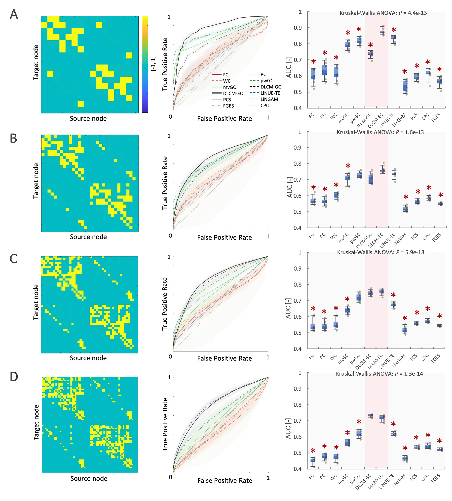

# Deep-Learning based Causal Model (DLCM) analysis toolbox

## Introduction
DLCM is a powerful tool of data-driven analysis and simulation technique to estimate Effective Connectivity (EC).
Based on DLCM framework, two types of EC are defined, such as DLCM-EC and DLCM-GC to measure causal relation among multiple time-series data.

This toolbox includes several causal analysis algorithms, such as DLCM-EC, DLCM-GC, multivariate Granger Causality, pair-wised Granger Causality,
linear Transfer Entropy, Functional Connectivity (Correlation), Partial Correlation and Wavelet Coherence to estimate EC from multiple node signals.

Command line tool could perform EC estimation with several causal analysis algorithms from node signals in csv file or mat file,
then show output causal relational matrix and save data in csv file.

## Requirements: software
* MATLAB R2019a or later
* Deep Learning Toolbox ver12.1 or later

## Command line tool
dlcm.m

## Example Results

## Citing DLCM
If you find DLCM useful in your research, please consider citing:  
Takuto Okuno, Alexander Woodward,
["DLCM: A Data-Driven Deep-Learning Based Effective Connectivity Estimation Toolbox"](https://yahoo.com/), under reviewing.

